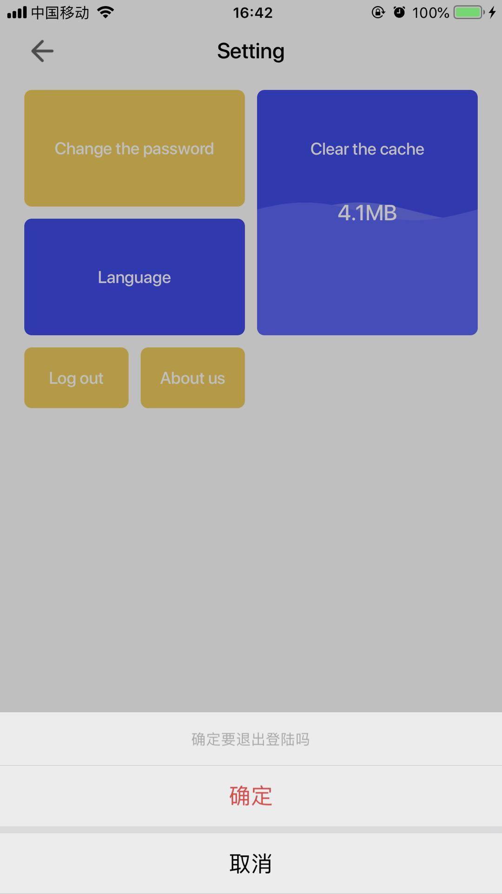
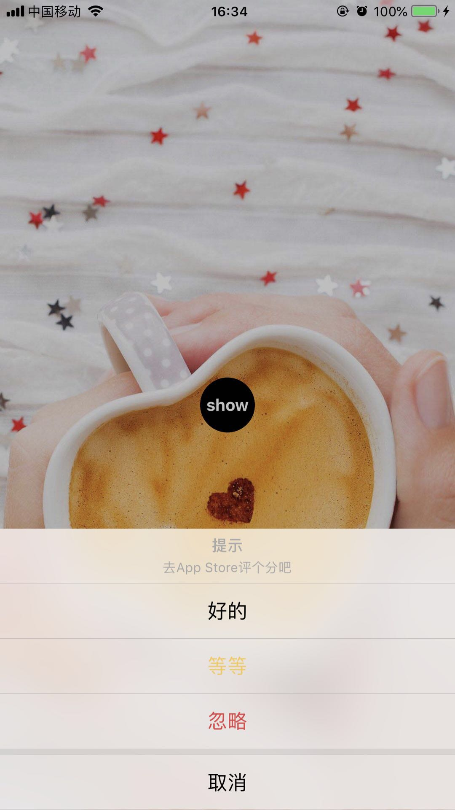

# SJCActionSheet
类似于微博微信的ActionSheet，用法和系统的ActionSheet用法一样，采用Block，非常简单，可定义成都高
## QQ：2439194386
更多好用的控件尽在邮箱
#
## 简介
`SJCActionSheet` 类似于微博微信
原文传送门 https://github.com/Lovezysong/SJCActionSheet
#
## 效果图：
- 
- 
https://cdn.yehwang.com/image/return_apply/20201224/7266f5a7435952018ec3c3cb2c8b4160.jpg
https://cdn.yehwang.com/image/return_apply/20201224/19309c3f5d7714129a50b077c8e08d04.jpg

<div align=center></div> <div align=center></div>
#
## Usage
An example:

```objective-c
SJCActionSheet *sheet = [SJCActionSheet sjcSheetWithTitle:@"提示" message:@"去App Store评个分吧"];
    SJCAction *action1 = [SJCAction actionWithTitle:@"好的" style:SJCActionStyleDefault handler:^(SJCAction *action) {
        NSLog(@"点击了%@",action.title);
    }];
    SJCAction *action2 = [SJCAction actionWithTitle:@"等等" style:SJCActionStyleCancel handler:^(SJCAction *action) {
        NSLog(@"点击了%@",action.title);
    }];
    SJCAction *action3 = [SJCAction actionWithTitle:@"忽略" style:SJCActionStyleDestructive handler:^(SJCAction *action) {
        NSLog(@"点击了%@",action.title);
    }];
    [sheet showWithActions:@[action1, action2, action3]];

